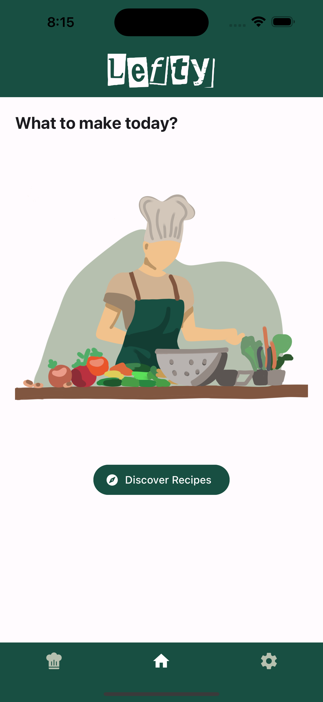
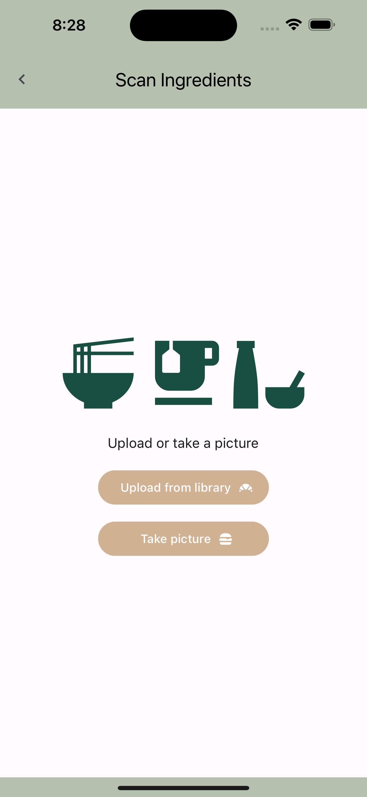
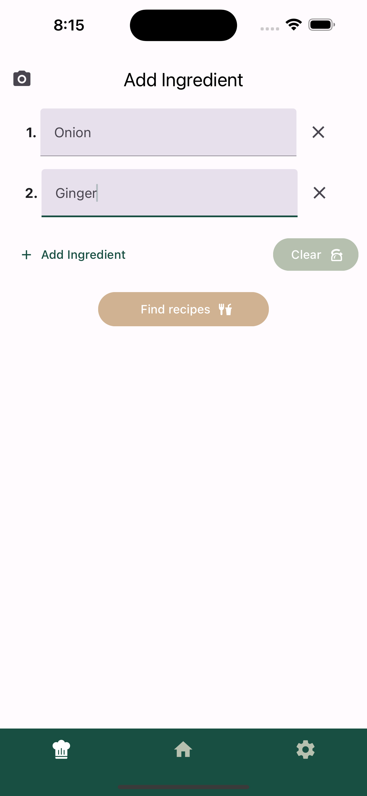
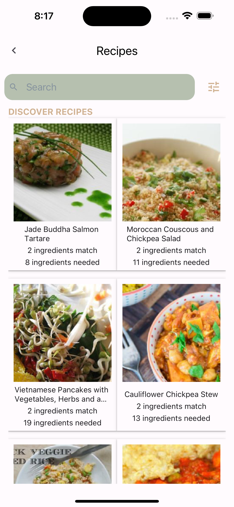
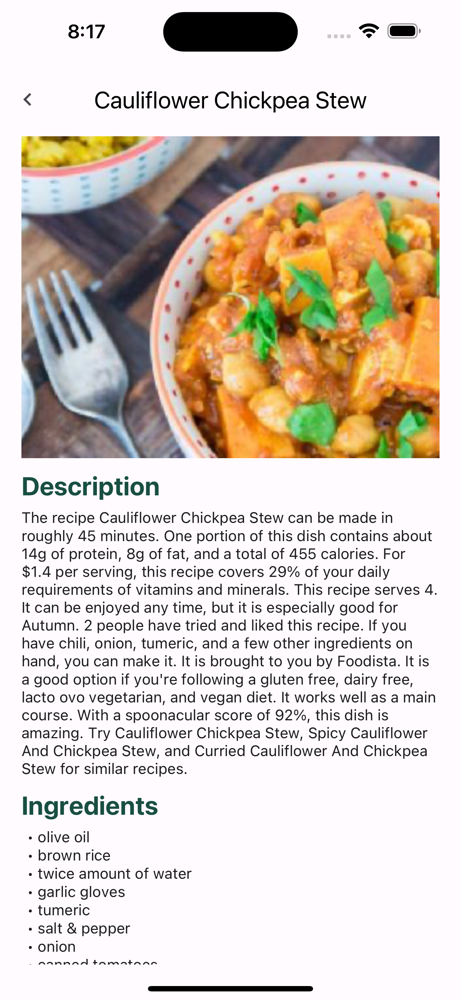
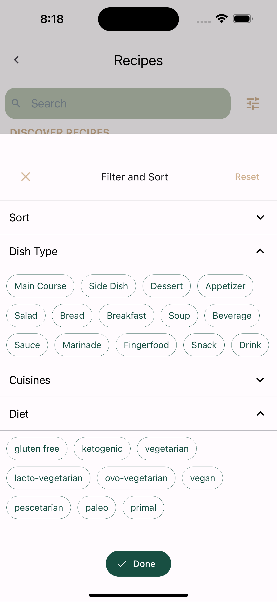

# Lefty

This app is designed to help you find the recipes by scanning the ingredients you have in order to reduce food waste.



## Features

- **Ingredient Scanning:** Easily add ingredients by scanning them with your device's camera.

  

- **Ingredient Management:** Customise your ingredients list by manually adding or deleting ingredients.

  

- **Recipe Search:** Search for mouth-watering recipes that match your ingredients.

  

- **Detailed Recipe View:** View more information about each recipe, including the description, list of required ingredients, and even a step-by-step cooking instructions.

  

- **Filter and Sort:** You can filter and sort to narrow down your recipe choices by dish type, cuisine, dietary preferences, and more.

  

## Installation (for frontend)

1. Clone the repository to your local machine:

   ```bash
   git clone https://github.com/ruishanteo/lefty.git
   ```

2. Navigate to the project directory:

   ```bash
   cd lefty
   ```

3. Install dependencies using your preferred package manager:

   ```bash
   npm install
   # or
   yarn install
   ```

4. Run the app on a connected device or emulator:

   ```bash
   npm start
   # or
   yarn start
   ```

5. Follow the on-screen instructions to launch the app.

## Technologies used

<p>


&nbsp;

</p>

## Other Links
- [**Video Demo**](https://www.youtube.com/watch?v=F4D22NqRaVY)
- [**Backend Repo**](https://github.com/ruishanteo/lefty-backend)
